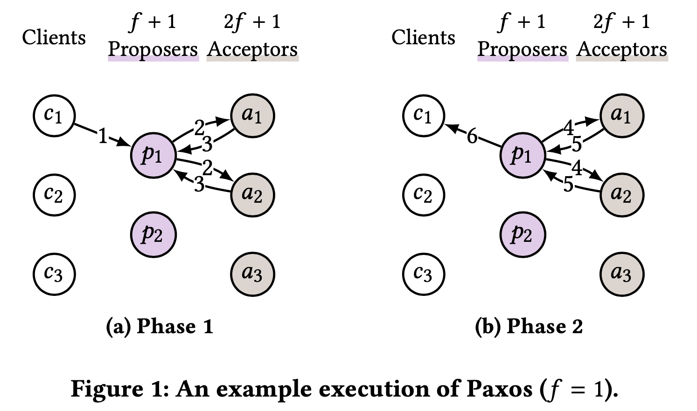
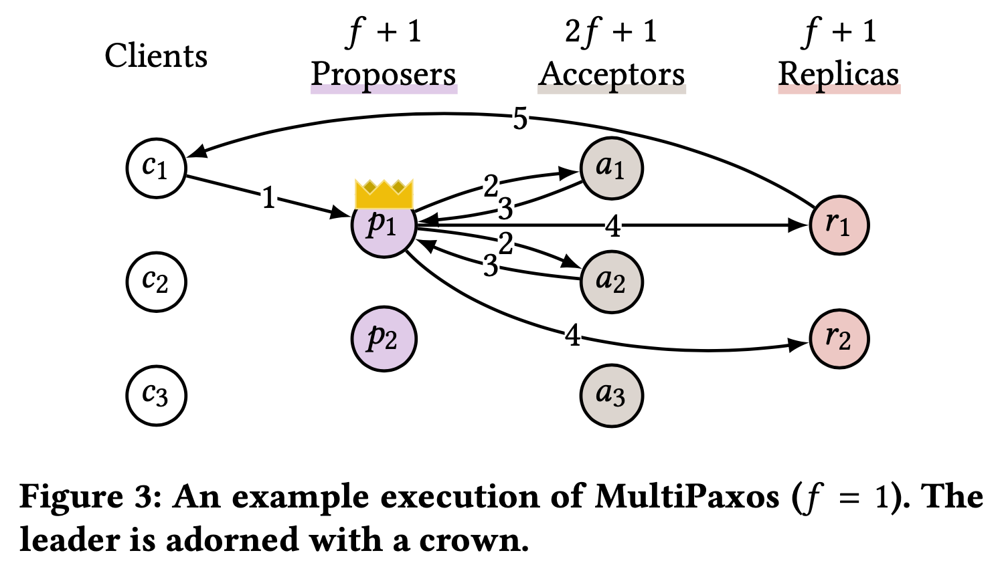
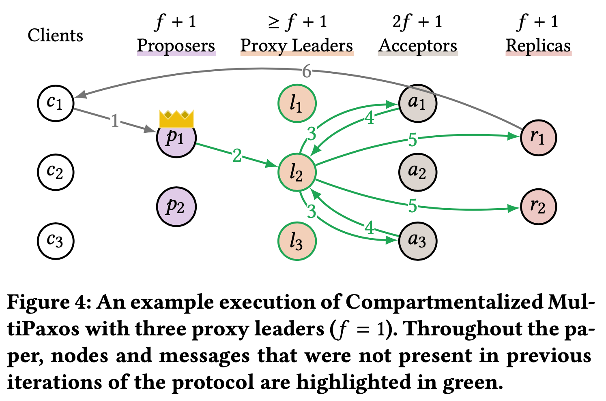
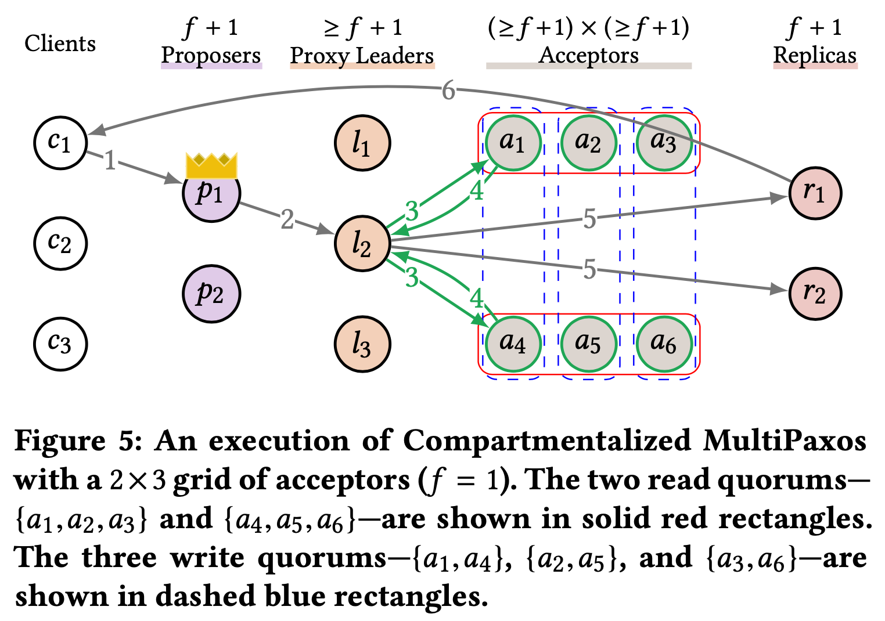
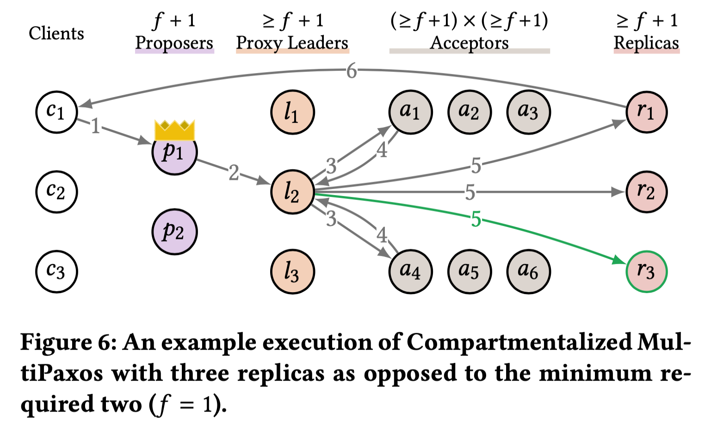
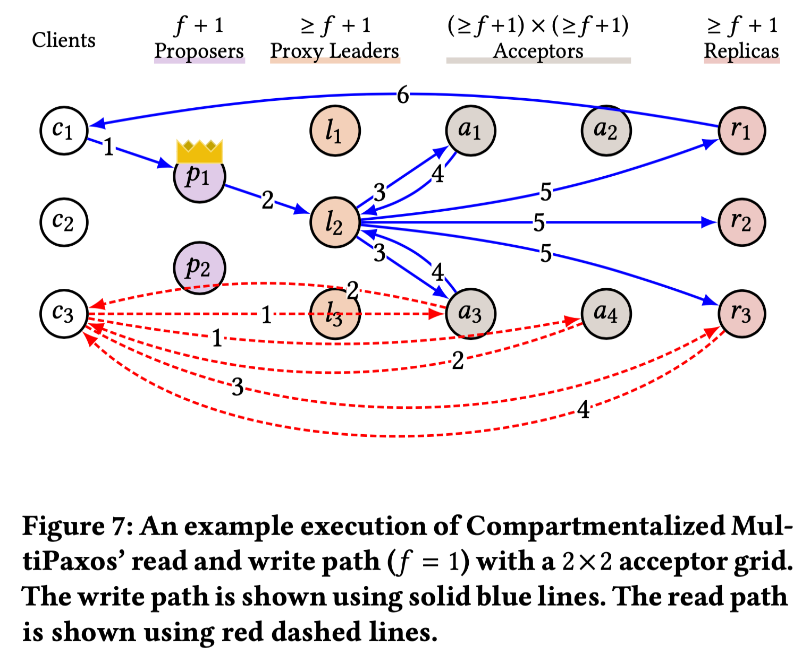
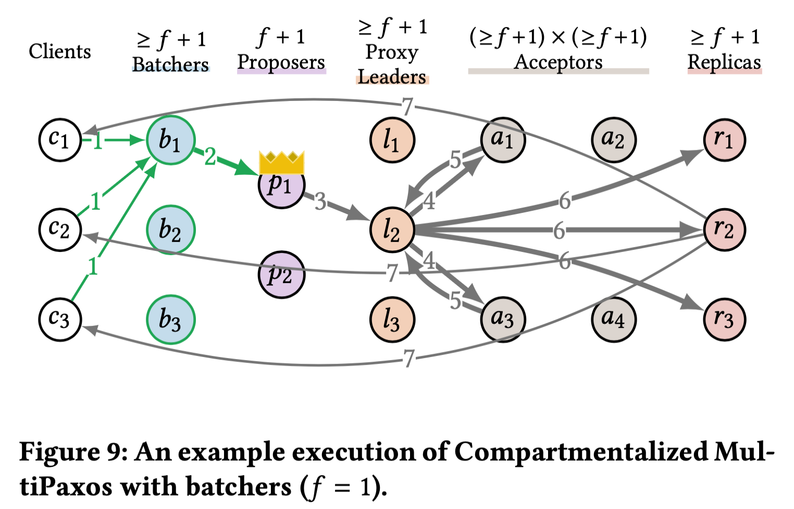
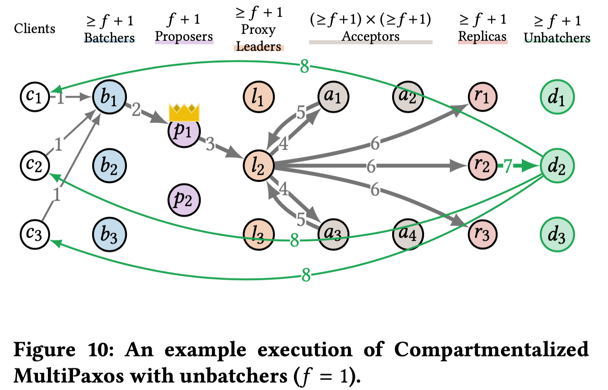

<http://www.vldb.org/pvldb/vol14/p2203-whittaker.pdf>

## MultiPaxos 의 확장성 문제

분산 시스템의 핵심 요소 중 하나는 State Machine Replication(SMR) 이며, 이를 통해
시스템의 일관성과 가용성을 유지할 수 있다. MultiPaxos 프로토콜은 SMR 을 구현하는
데 널리 사용되지만 처리량 병목 현상을 일으키는 주요 원인으로 리더의 역할이
지목되어 왔다. 이는 시스템 전체의 성능 저하로 이어지는데, 특히 리더가 모든
명령어 Sequencing 과 Broadcasting 을 담당하면서 발생하는 문제다.

"Scaling Replicated State Machines with Compartmentalization" 논문은 이러한
문제를 인식하고, MultiPaxos 프로토콜의 확장성을 향상시키기 위한 새로운 접근
방식을 제안한다. 논문의 핵심 아이디어는 compartmentalization, 즉 시스템의 다양한
구성 요소를 분리하고 독립적으로 확장 가능하게 하는 것이다. 이를 통해 각 구성
요소의 병목 현상을 줄이고 전체 시스템의 처리량과 확장성을 크게 향상시킬 수 있다.

## Paxos 와 MultiPaxos

Paxos 는 분산 시스템에서 consensus 를 달성하기 위한 프로토콜로, 제안된 값들
가운데 단일 값을 선택하는 과정을 거친다. Paxos 프로토콜은 장애를 견딜 수 있는
방식으로 설계되어 있으며, 일반적으로 clients, proposers, 그리고 acceptors 로
구성된다. Client 가 값 제안을 원할 때, 이 값을 proposer 에게 전달하고 proposer
는 두 단계의 프로토콜을 시작한다.

**Phase 1: Prepare**

- proposer `p`는 최소한 (2f + 1) acceptors 중 과반수에게 Phase1A 메시지를
  보낸다. 이는 시스템이 `f`개의 장애를 견딜 수 있음을 의미한다.
- acceptor 가 Phase1A 메시지를 받으면, 이전에 어떤 값이 선택되었는지를 proposer
  에게 알리는 Phase1B 메시지로 응답한다.
- leader 는 과반수의 acceptors 로부터 Phase1B 메시지를 받으면 Phase 2 를
  시작한다.

**Phase 2: Accept**

- Phase 2 에서, proposer 는 어떤 값 `x`를 선택하기 위해 acceptors 에게
  Phase2A(x) 메시지를 보낸다.
- acceptor 는 Phase2A(x) 메시지를 받고, 해당 메시지를 무시하거나 값 `x`에 대해
  투표하여 Phase2B(x) 메시지로 proposer 에게 응답할 수 있다.
- proposer 는 과반수의 acceptors 로부터 Phase2B(x) 메시지를 받으면, 제안된 값
  `x`가 선택된 것으로 간주한다.

이 과정을 통해, Paxos 프로토콜은 분산 시스템 내에서 단일 값에 대한 합의를 달성할
수 있다. MultiPaxos 는 이 프로토콜을 확장하여, 값의 시퀀스 (a.k.a. log) 를
선택하는 과정을 가능하게 하여, 결정론적 상태 머신 (deterministic state machine)
을 효과적으로 복제할 수 있는 방법을 제공한다. MultiPaxos 에서는 각 로그 항목에
대해 하나의 Paxos 인스턴스를 사용하여, 시스템이 다양한 명령어들을 순서대로
처리하고 동기화된 상태를 유지할 수 있도록 한다. 이러한 방식으로, MultiPaxos 는
분산 시스템의 일관성과 가용성을 보장하는 강력한 메커니즘을 제공한다.

MultiPaxos 프로토콜에서의 명령 처리 과정은 다음과 같다:

1. **Leader 선출과 Phase 1 실행**: proposers 중 하나가 leader 로 선출되어 각
   로그 항목에 대해 Paxos 의 Phase 1 을 실행한다. 클라이언트가 상태 머신 명령
   (state machine command) `x`를 제안하고자 할 때, 이 명령을 leader 에게 보낸다
   (1).
2. **Log 할당 및 Phase 2 실행**: Leader 는 명령에 로그 항목 `i`를 할당한 다음,
   `i`번째 Paxos 인스턴스의 Phase 2 를 실행하여 로그 항목 `i`에 값 `x`를
   선택하게 한다. 즉, leader 는 acceptors 에게 Phase2A(i,x) 메시지를 보내어 슬롯
   `i`에서 값 `x`에 대해 투표하도록 한다 (2).
3. **Acceptor 의 투표와 응답**: 정상적인 경우 모든 acceptors 는 슬롯 `i`에서
   `x`에 투표하고 Phase2B(i,x) 메시지로 응답한다 (3).
4. **Replicas 에게 통지**: Leader 가 주어진 로그 항목에서 명령이 선택되었다는
   것을 알게 되면 (즉, 과반수의 acceptors 로부터 Phase2B(i,x) 메시지를 받으면),
   이를 replicas 에게 알린다 (4). Replicas 는 명령을 로그에 삽입하고 로그를
   앞에서부터 실행한다.

Leader 는 명령을 로그 항목에 순차적으로 할당한다. 첫 번째로 받은 명령은 항목 0
에, 다음 명령은 항목 1 에, 그 다음 명령은 항목 2 에 배치되는 식이다. 또한, 모든
replica 가 모든 명령을 실행하긴 하지만, 주어진 상태 머신 명령 `x`에 대해, 결과를
클라이언트에게 보내는 것은 오직 한 replica 만 필요하다 (5). 예를 들어, 로그
항목은 replicas 간에 라운드 - 로빈 방식으로 분할될 수 있다.

## Compartmentalizing MultiPaxos

### Compartmentalization 1: Proxy Leaders

#### Bottleneck

MultiPaxos 프로토콜에서 leader 는 throughput 병목의 주요 원인이다. Leader 는
클라이언트로부터 명령을 받아 해당 명령에 대한 로그 항목을 할당하고 이를 모든
acceptors 에게 전달해야 한다. 이 과정에서 leader 는 상당한 수의 메시지를 보내고
받아야 하며 이는 시스템 전체의 throughput 을 제한하는 병목 현상을 일으킨다.

#### Decouple

Compartmentalization 의 첫 번째 방법으로 Proxy Leaders 가 제안되었다. 이
접근법은 leader 의 두 가지 주요 책임인 command sequencing 과 command
broadcasting 을 분리한다. Command sequencing 은 leader 가 계속 담당하고, command
broadcasting 은 새로 도입된 Proxy Leaders 가 맡게 된다.

#### Scale

Proxy Leaders 의 도입은 leader 의 부하를 획기적으로 줄여 시스템의 확장성과
throughput 을 크게 향상시킨다. 각 Proxy Leader 는 독립적으로 작동하기 때문에,
Proxy Leaders 의 수를 증가시키면 시스템의 throughput 을 선형적으로 늘릴 수 있다.
이는 leader 가 이제 command sequencing 만을 담당함으로써, 전체 시스템의 병목
현상이 크게 완화된다.

#### Discussion

Proxy Leaders 는 MultiPaxos 프로토콜의 처리량과 확장성 문제를 해결하는 효과적인
해법을 제공한다. Leader 의 부담을 줄임으로써, 시스템은 더 높은 throughput 을
달성하고, 다양한 작업 부하에서도 성능을 개선할 수 있다. 이러한 접근 방식은 분산
시스템 설계와 최적화에 있어 중요한 기여를 하며, 특히 복잡한 시스템에서의
scalability 와 reliability 문제를 해결하는 데 있어 새로운 방향을 제시한다.

### Compartmentalization 2: Acceptor Grids

#### Bottleneck

Leader 의 compartmentalization 이후, acceptors 가 throughput 병목이 될 수 있다.
일반적으로 acceptors 는 scale 이 되지 않는다고 여겨지며, "f 개의 장애를 처리하기
위해 2f + 1 개 이상의 acceptors 를 사용하는 것은 가능하지만, 더 큰 quorum 크기를
요구하면서 추가적인 이점이 없기 때문에 비합리적"이라는 의견이 있다. Acceptor 의
수를 무분별하게 증가시키는 것은 권장되지 않는다.

#### Decouple

Acceptor Grids 는 flexible quorums 를 사용하여 acceptors 를 compartmentalize
한다. 기본 MultiPaxos 는 2f + 1 개의 acceptors 를 요구하며, leader 는 Phase 1 과
Phase 2 에서 각각 f + 1 개의 acceptors 와 통신한다 (acceptors 의 과반수). 이 f +
1 개의 acceptors 집합은 quorums 라고 불리며, MultiPaxos 의 정확성은 어떤 두
quorums 도 교차한다는 사실에 기반한다.

Read quorums 와 write quorums 를 분리함으로써, 다수결 quorums (majority quorums)
대신 더 효율적인 quorums 집합을 사용하여 acceptors 의 부하를 줄일 수 있다.
구체적으로, acceptors 를 r * w 사각형 grid 로 배열하고, r,w ≥ f +1 로 한다. 모든
행은 read quorum 을 형성하고, 모든 열은 write quorum 을 형성한다. 즉, leader 는
Phase 1 에서 임의의 행의 acceptors 에게 연락하고, Phase 2 에서 모든 명령에 대해
임의의 열의 acceptors 에게 연락한다.

#### Scale

다수결 quorums 를 사용할 때, 모든 acceptor 는 모든 상태 머신 명령의 적어도
절반을 처리해야 한다. Grid quorums 를 사용하면, 모든 acceptor 는 상태 머신
명령의 1/w 만큼만 처리하면 된다. 따라서 w (grid 의 열 수) 를 증가시켜 acceptors
의 부하를 줄이고 throughput 병목을 제거할 수 있다.

#### Discussion

Proxy leaders 와 마찬가지로, decoupling 은 scaling 을 가능하게 한다. 다수결
quorums 에서는 read 와 write quorums 가 결합되어 있어, acceptors 의 수를
증가시키면 quorums 의 크기도 커진다. Acceptor grids 는 acceptors 의 수를 write
quorums 의 크기와 분리시켜, acceptors 를 늘리고 부하를 줄일 수 있게 한다.

또한 write quorums 의 수를 증가시키면 read quorums 의 크기가 증가하고, 이는
leader 가 Phase 1 에서 연락해야 하는 acceptors 의 수를 증가시킨다. 논문 저자는
Phase 2 가 일반적인 경우에 실행되고 Phase 1 은 leader 실패 시에만 실행되므로,
이는 합당한 trade-off 라고 주장한다.

### Compartmentalization 3: More Replicas

#### Bottleneck

Leader 와 acceptors 의 compartmentalization 이후, replicas 가 병목 현상을 일으킬
수 있다. replicas 를 단순히 증가시키는 것은 두 가지 이유로 인해 효과적이지 않다.
첫째, 모든 replica 는 모든 상태 머신 명령을 수신하고 실행해야 한다. 이는 실제로
정확하지 않지만, 다음 compartmentalization 에서 이에 대해 다룰 예정이다. 둘째,
acceptors 와 마찬가지로, replicas 의 수를 증가시키면 leader 에 대한 부하가
증가한다. 하지만 proxy leaders 를 도입함으로써 이제는 replicas 의 수를 자유롭게
증가시킬 수 있다. 예를 들어, Figure 6 에서는 최소 요구 사항인 두 개 대신 세 개의
replicas 를 사용한 MultiPaxos 를 보여준다.

#### Scale

모든 replica 가 모든 명령을 실행해야 한다면, replicas 의 수를 증가시키는 것이
그들의 부하를 감소시키는가? 대답은 "그렇다 이다. 모든 replica 가 모든 상태
머신을 실행해야 하지만, 명령 실행 결과를 클라이언트에게 보내야 하는 replica 는
하나뿐이다. 따라서, n 개의 replicas 가 있을 때, 각 replica 는 명령의 1/n 만
결과를 보내면 된다. replicas 의 수를 증가시키면, 각 replica 가 보내야 하는
메시지의 수를 줄일 수 있다. 이는 replicas 의 부하를 줄이고, 그들이 throughput
병목이 되는 것을 방지하는 데 도움이 된다. 예를 들어, Figure 6 에서 세 개의
replicas 가 있는 경우, 각 replica 는 모든 명령의 1/3 만 답변해야 한다. 두 개의
replicas 가 있는 경우, 각 replica 는 모든 명령의 절반에 답변해야 한다. 다음
compartmentalization 에서는 replicas 의 수를 증가시키는 것의 또 다른 주요 장점을
볼 수 있다.

#### Discussion

다시 한번 decoupling 은 scaling 을 가능하게 한다. Leader 와의 decoupling 및
proxy leaders 의 도입 없이는 replicas 의 수를 증가시키는 것이 성능에 해를
끼친다.

### Compartmentalization 4: Leaderless Reads

#### Bottleneck

이제 leader, acceptors, 그리고 replicas 를 compartmentalize 했다. 이 시점에서
병목 현상은 두 곳 중 하나에 있다. leader 가 여전히 병목일 수 있으며, replicas 가
병목일 수 있다. 다행히 단일 compartmentalization 으로 두 병목 모두를 우회할 수
있다.

#### Decouple

상태 머신의 상태를 변경하는 명령을 write 라고 하고 상태를 변경하지 않는 명령을
read 라고 한다. leader 는 write 를 처리해야 한다. 왜냐하면 write 를 linearize
해야 하기 때문이다. 모든 replica 는 write 를 처리해야 한다. 그렇지 않으면
replicas 의 상태가 다를 수 있기 때문이다 (예를 들어, 한 replica 가 write 를
수행하지만 다른 replicas 는 수행하지 않는 경우). 하지만, read 는 상태 머신의
상태를 변경하지 않으므로, leader 가 이를 linearize 할 필요가 없으며 (읽기는 교환
가능하다), 단일 replica 만 read 를 실행해도 된다.

이 관찰을 활용하여 read path 를 write path 로부터 분리한다. write 는 이전과 같이
처리한한다. 반면에 read 의 경우, Paxos Quorum Reads (PQR) 에서 제안된 아이디어를
사용하여 leader 를 우회하고 단일 replica 에서 read 를 수행한다. 구체적으로 read
를 수행하기 위해, 클라이언트는 read quorum 의 acceptors 에게 PreRead() 메시지를
보낸다. PreRead() 메시지를 받은 acceptor ai 는
PreReadAck(wi) 메시지를 반환하는데, 여기서 wi 는 acceptor
가 투표한 가장 큰 로그 항목의 인덱스다 (i.e. acceptor 가 Phase2B 메시지를 보낸
가장 큰 로그 항목). 이 wi 를 vote watermark 라고 부른다. 클라이언트가
read quorum 의 acceptors 로부터 PreReadAck 메시지를 받으면, 모든 수신된 vote
watermarks 의 최대값을 계산한다. 그런 다음 클라이언트는 상태 머신의 상태를
변경하지 않는 임의의 read x 에 대해 Read(x,i) 요청을 replicas 중 하나에게
보낸다.

클라이언트로부터 Read(x,i) 요청을 받은 replica 는 로그 항목 i 에서 명령을 실행할
때까지 기다린다. replicas 는 로그 순서대로 명령을 실행하므로, replica 가 로그
항목 i 에서 명령을 실행했다면 i 보다 작은 모든 로그 항목의 명령도 실행했음을
의미한다. replica 가 로그 항목 i 에서 명령을 실행한 후, x 를 실행하고 결과를
클라이언트에게 반환한다. replica 가 Read(x,i) 메시지를 받았을 때, 이미 i 를
넘어서 로그를 실행했을 수 있다. 즉, i + 1, i + 2 등의 로그 항목의 명령을 이미
실행했을 수 있다. 이는 replica 가 로그 항목 i 에서 명령을 실행했다면, x 를
실행하는 것이 안전함을 의미한다. 이 프로토콜이 linearizable reads 를 정확하게
구현한다는 증명은 저자의 technical report 에서 확인할 수 있다.

#### Scale

분리된 read 와 write 경로는 Figure 7 에서 보여진다. Reads 는 acceptors 의 행
(read quorum) 으로 보내지므로, acceptors 의 수를 증가시켜 각 개별 acceptor 의
read 부하를 감소시킬 수 있으며, 이는 acceptors 를 read 병목에서 제거한다. Reads
는 단일 replica 로도 보내지므로, replicas 의 수를 증가시켜 read 병목도 제거할 수
있다.

#### Discussion

많은 작업 부하가 read-heavy 다. Chubby 는 1% 미만의 작업이 write 라고 관찰하였고
Spanner 는 0.3% 미만의 작업이 write 라고 관찰하였다.

acceptor grid 에서 열의 수를 증가시키는 것은 acceptors 의 write 부하를 줄이고,
행의 수를 증가시키는 것은 acceptors 의 read 부하를 줄인다. 행과 열의 수는
독립적으로 조정될 수 있다. read throughput 을 증가시키는 것 (행의 수를
증가시킴으로써) 은 write throughput 을 감소시키지 않으며, 반대도 마찬가지다.
하지만 행의 수를 증가시키는 것은 열의 크기 (하지만 수는 아님) 를 증가시키므로,
행의 수를 증가시키는 것은 write 의 tail latency 를 증가시킬 수 있고, 반대도
마찬가지다.

### Compartmentalization 5: Batchers

#### Bottleneck

Batching 은 명령 처리의 통신 및 계산 비용을 분산시켜 throughput 을 증가시킨다.
예를 들어, batching 없이는 acceptor 가 명령당 두 개의 메시지를 처리하지만,
batching 을 사용하면, acceptor 는 배치당 두 개의 메시지만 처리한다. 배치 크기가
증가함에 따라 acceptor 가 명령당 처리하는 메시지 수가 감소한다. 예를 들어, 배치
크기가 10 인 경우, batching 을 사용하여 acceptor 가 명령당 처리하는 메시지 수가
10 배 감소한다.

#### Decouple

Leader 는 배치를 형성하고 배치를 순서대로 배열하는 두 가지 책임이 있다. 이 두
책임을 분리하기 위해 최소 f + 1 개의 batchers 를 도입한다. Batchers 는 배치
형성을 담당하며, leader 는 배치 순서를 담당한다.

보다 구체적으로, 클라이언트가 상태 머신 명령을 제안하고자 할 때, 임의로 선택된
batcher 에게 명령을 보낸다 (1). 클라이언트로부터 충분한 수의 명령을 수신하거나
타임아웃이 만료된 후, batcher 는 명령을 배치에 넣고 이를 leader 에게 전달한다
(2). Leader 가 명령 배치를 받으면, 이에 로그 항목을 할당하고, Phase2A 메시지를
형성하여 proxy leader 에게 보낸다 (3). 프로토콜의 나머지 부분은 변경되지 않는다.

Batchers 없이는 leader 가 n 개의 명령 배치당 n 개의 메시지를 수신해야 한다.
Batchers 가 있으면, leader 는 단 하나의 메시지만 수신하면 된다. 이는 병목 현상을
일으키는 leader 의 부하를 감소시키거나 병목 현상을 완전히 제거한다.

#### Scale

Batchers 는 병렬 수행이 가능하다. 그들이 throughput 병목이 되지 않을 때까지
batchers 의 수를 증가시킬 수 있다.

#### Discussion

Read batching 은 write batching 과 매우 유사하다. 클라이언트는 read 를 임의로
선택된 batchers 에게 보내고, batchers 는 read 를 배치로 그룹화한다. Batch 가
read 배치 X 를 형성한 후, batcher 는 read quorum 의 acceptors 에게 PreRead()
메시지를 보내고, 결과적인 watermark i 를 계산한 후, replicas 중 하나에게
Read(X,i) 요청을 보낸다.

### Compartmentalization 6: Unbatchers

#### Bottleneck

n 개의 명령 배치를 실행한 후 replica 는 n 개의 클라이언트에게 n 개의 메시지를
다시 보내야 한다. 따라서 replicas 는 (batchers 가 없는 leader 와 마찬가지로)
명령의 수에 따라 선형적으로 증가하는 통신 오버헤드를 겪는다.

#### Decouple

Replicas 는 명령 배치를 실행하고 클라이언트에게 답변을보내는 두가지 책임이 있다.
이 두 책임을 분리하기 위해 최소 f + 1 개의 unbatchers 를 도입한다. Replicas 는
명령 배치를 실행하는 책임을 지며, unbatchers 는 명령 실행 결과를 클라이언트에게
보내는 책임을 진다. 구체적으로, 명령 배치를 실행한 후 replica 는 결과 배치를
형성하고 임의로 선택된 unbatcher 에게 결과 배치를 보낸다 (7). 결과 배치를 받은
unbatcher 는 결과를 클라이언트에게 보낸다 (8). 이 분리는 replicas 의 부하를
줄인다.

#### Scale

Batchers 와 마찬가지로, unbatchers 는 병렬 실행기 가능하므로 throughput 병목이
되지 않을 때까지 unbatchers 의 수를 증가시킬 수 있다.

#### Discussion

Read unbatching 은 write unbatching 과 동일하다. Read 배치를 실행한 후, replica
는 해당하는 결과 배치를 형성하고 임의로 선택된 unbatcher 에게 보낸다.

## 실험 결과 및 결론

Compartmentalization 기법을 실제 MultiPaxos 에 적용한 실험 결과는 MultiPaxos 의
성능과 확장성을 상당히 개선할 수 있음을 보여준다. 특히 write-only 및 mixed
read-write 워크로드에서 최대 6 배 및 16 배의 처리량 증가를 달성했다.
