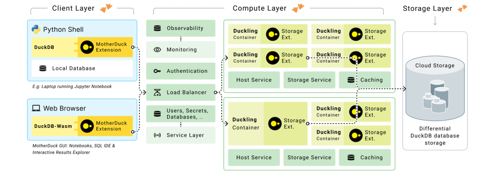
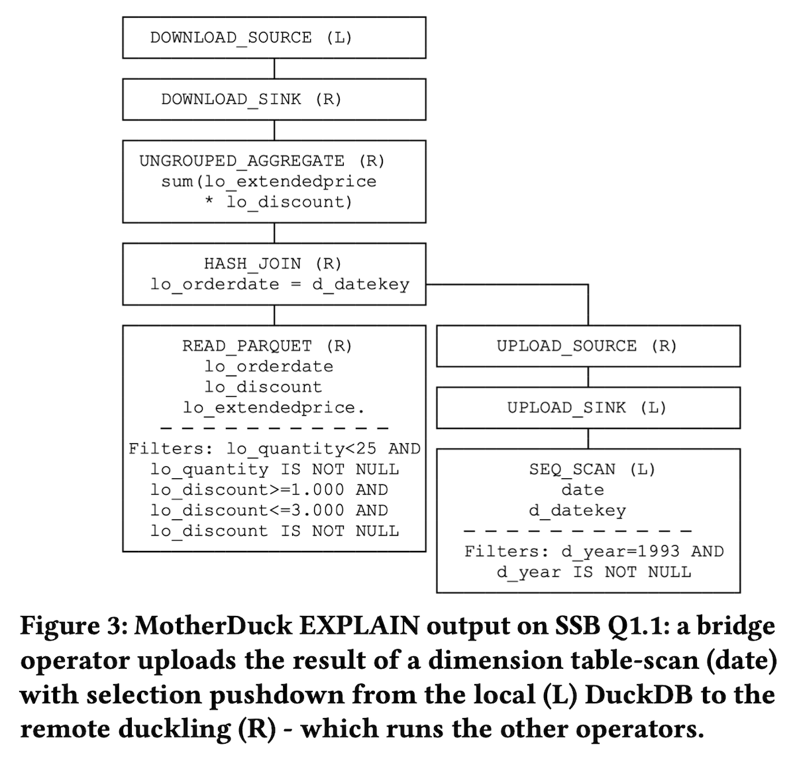

MotherDuck 은 클라우드에서 DuckDB 데이터베이스를 활용하여 서버리스 쿼리 처리를
제공하는 새로운 서비스이며 다음의 특징을 갖는다.

- Hybrid Query Processing: 하나의 쿼리가 로컬과 클라우드 데이터 소스를 동시에
  사용해서 처리한다.
- Reducing Cloud Footprint: 스케일 아웃을 피하고 단일 노드 아키텍처의 단순성을
  선택한다. 이 접근 방식은 대부분의 데이터베이스가 1 TB 미만이고 대부분의 쿼리가
  10 GB 미만의 데이터를 포함한다는 관찰에 기반한다.
- Enabling New Applications: 클라이언트와 서버에서 모두 쿼리를 처리하는 구조가
  새로운 애플리케이션 개발을 가능하게 할 것이다. 예를 들면, MotherDuck 에
  웹클라이언트는 DuckDB-wasm 을 내장한 웹앱으로 구축된다.
- Scaling Existing Applications: 기존 애플리케이션을 쉽게 확장할 수 있다. 데이터
  과학자가 랩탑에서 설계한 데이터 분석 파이프라인을 쉽게 클라우드에서 운영할 수
  있게 된다.

## Infrastructure

### Compute Layer

컴퓨팅 플랫폼은 동적으로 생성되고 소멸되는 컨테이너를 기반으로 한다. 각
컨테이너는 하나의 DuckDB 인스턴스 (저자는 duckling 이라고 부른다) 를 실행하여
개별 사용자의 요청을 처리한다. 사용 중이지 않을 때 컨테이너를 완전히
종료함으로써 리소스를 효율적으로 사용한다. MotherDuck 은 컨테이너의 리소스를
동적으로 조정해서 DuckDB 의 성능과 효율성을 높인다. 이러한 기능은 데이터 분석에
필요한 리소스가 변동적인 애플리케이션에 유용하다.

### Storage Layer

클라우드 스토리지 시스템에 최적화된 DuckDB 데이터베이스 스토리지를 제공한다.
이는 클라우드 제공 업체가 제공하는 공유, 확장 가능한 분산 스토리지 패브릭을
기반으로 구축되어 있으며, 로컬 SSD 를 활용한 캐싱을 통해 성능을 향상시킨다. 파일
수정 대신 새 파일 작성과 삭제로 데이터 변경을 처리하며, zero-copy 복제
(duplication), 공유 (sharing), 분기 (branching), 시간 여행 (time travel) 을
가능하게 한다. MotherDuck 은 다중 데이터베이스 접근을 지원하고, 클라우드
데이터베이스와 로컬 데이터베이스 모두에 연결할 수 있는 기능을 제공한다.

## Hybrid Query Processing

MotherDuck 클라이언트 확장 모듈은 DuckDB 쿼리의 파싱, 바인딩 (카탈로그 조회 및
타입 체킹), 쿼리 최적화, 실행 단계에 연결되어 SQL 표현을 풍부하게 하고, 클라우드
파일 (예: CSV) 에 대한 원격 바인딩을 수행하며, 하이브리드 쿼리 처리를 계획하기
위해 최적화기를 확장하고, 로컬 및 클라우드에서 실행을 확장한다.

하이브리드 쿼리 처리 효율성을 Star Schema Benchmark (SSB) 를 통해 입증한다.
벤치마크 설정은 S3 에 Parquet 파일로 저장된 팩트 테이블 (fact table) 과 랩탑의
DuckDB 에 저장된 차원 테이블 (dimension table) 로 구성한다. DuckDB 를 사용하여
SSB 쿼리 중 일부를 MotherDuck 사용 여부에 따라 (fully local vs. hybrid query
processing) 실행한다. Figure 3 은 로컬에서 차원 테이블에 대한 테이블 스캔과
필터를 수행한 다음, 데이터를 duckling 에 업로드하기 위해 브릿지 연산자를
사용하고, 리모트에서 팩트 테이블과 조인 및 집계되는 하이브리드 쿼리 계획을
보여준다.\
벤치마크는 Apple M1 MacBook Air 와 AWS 의 m6gd.4xlarge VM 을 사용했다.
MotherDuck 을 사용한 하이브러드 쿼리 처리 방식이 약 5 배에서 약 10 배 더 빠른
처리 속도를 보였으며, 이는 duckling 의 더 많은 코어와 S3 의 높은 대역폭
때문이다.

Paper: <https://www.cidrdb.org/cidr2024/papers/p46-atwal.pdf>
