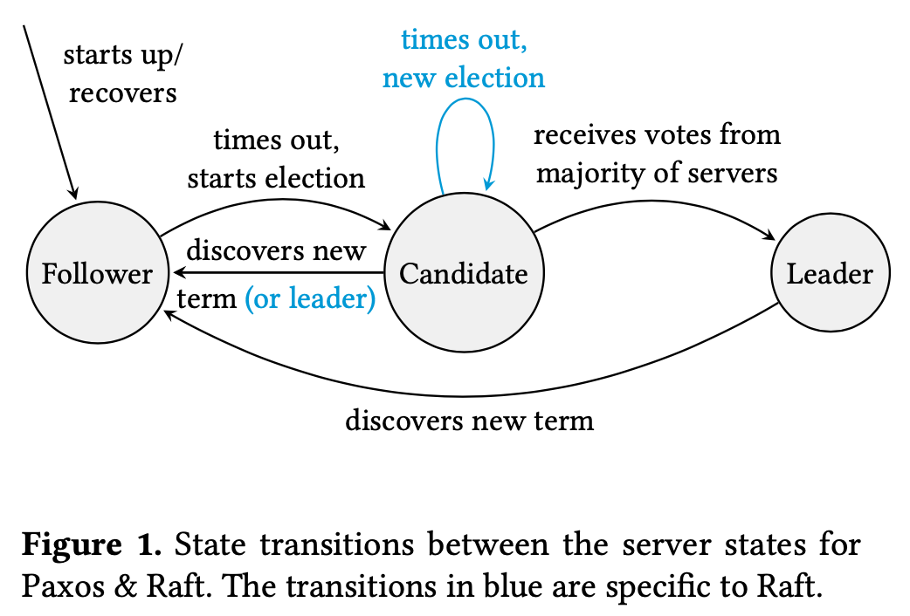
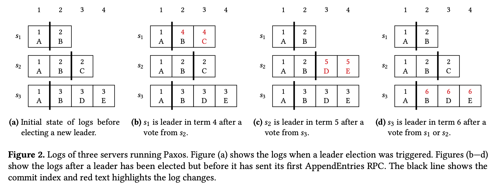

URL: <https://dl.acm.org/doi/abs/10.1145/3380787.3393681>

분산 합의 (distributed consensus) 는 장애를 견디고 강력한 일관성을 가진 분산
시스템을 구축하는 데 필수적이다. 많은 분산 합의 알고리즘이 제안되었지만, 실제
프로덕션 시스템에서는 주로 Paxos 와 Raft 가 널리 사용된다. 이 논문은 분산 합의에
대한 더 나은 해결책이 Paxos 인지 Raft 인지를 고찰한다. Raft 의 용어와 추상화를
사용해 Paxos 알고리즘을 설명함으로써 두 알고리즘이 어떻게 다른지 분석한다.

저자는 Paxos 와 Raft 가 분산 합의에 매우 유사한 접근 방식을 취하며, 주로 리더
선출 (leader election) 방식에서만 차이가 있음을 발견했다. 가장 주목할 만한
차이점은 Raft 는 최신 로그를 가진 서버만 리더가 될 수 있도록 허용하는 반면,
Paxos 는 어떤 서버도 리더가 될 수 있으나 이후에 자신의 로그를 업데이트해 최신
상태로 유지해야 한다는 점이다. Paxos 와 달리 리더 선출 동안 로그 항목 (log
entry) 을 교환할 필요가 없기 때문에 Raft 의 접근 방식은 단순하면서도 효율적이다.
저자는 Raft 의 이해하기 쉬움이 알고리즘 자체의 근본적인 요소보다는 논문의 명확한
표현에서 비롯되었다고 이야기한다.

이 논문은 상태 머신 복제 (state machine replication) 의 맥락에서 분산 합의를
검토한다. 상태 머신 복제는 애플리케이션의 결정적 상태 머신 (deterministic state
machine) 이 n 개의 서버에 걸쳐 복제되어야 하며, 각각이 동일한 작업 집합 (set of
operations) 을 동일한 순서로 적용해야 한다는 요구를 가진다. 이는 일반적으로
Paxos 나 Raft 와 같은 분산 합의 알고리즘에 의해 관리되는 복제 로그 (replication
log) 를 사용하여 달성된다.

이 논문의 Paxos 는 multi-decree Paxos (혹은 MultiPaxos) 에 가깝다. 저자는 이
논문에서 Paxos 를 설명할 때 다른 논문들과 다른 용어를 사용하거나 단순화된 접근
방식을 사용한다. 예를 들면, proposer, acceptor, learner (또는 leader, acceptor,
replica) 로 노드의 역할을 나누어 설명하기 보다는 서버라는 단일 역할로 설명한다.
다른 논문의 views, ballot numbers, epoch 등의 용어 대신 term 이라는 용어를
사용한다. log entry 는 순서대로 복제되고 log gap 을 채우는 복잡함은 가정하지
않는다. 이에 대한 상세한 설명은 논문의 "5 Relation to classical Paxos" 챕터를
확인하면 된다.

## Paxos and Raft

논문은 Paxos 와 Raft 의 핵심 요소에 초점을 맞추며 garbage collection, log
compaction, read operations, reconfiguration 알고리즘을 비교하지 않는다.

Paxos 와 Raft 를 포함한 많은 합의 알고리즘은 분산 합의 문제를 해결하기 위해 리더
기반 접근 방식 (leader-based approach) 을 사용한다. 이런 알고리즘들은 다음과
같이 작동한다: n 개의 서버 중 하나가 리더로 지정된다. 상태 머신에 대한 모든
작업은 리더에게 전송된다. 리더는 작업을 자신의 로그에 추가하고 다른 서버들에게도
동일하게 할 것을 요청한다. 리더가 과반수의 서버로부터 이 작업이 수행되었다는
확인 (acknowledge) 을 받으면 해당 작업을 자신의 상태 머신에 적용 (apply) 한다.
이 과정은 리더가 실패할 때까지 반복된다. 리더가 실패하면 다른 서버가 리더를
이어받는다. 새 리더를 선출하는 이 과정은 과반수 서버를 포함하며, 새 리더가
이전에 적용된 작업을 덮어쓰지 않도록 보장한다.

서버는 세 가지 상태 중 하나다:

- Follower: RPC 에 응답만하는 수동적인 (passive) 상태다.
- Candidate: RequestVote RPC 를 사용하여 리더가 되려고 시도하는 활성 (active)
  상태다.
- Leader: AppendEntries RPC 를 사용하여 복제된 로그에 작업을 추가하는 책임이
  있는 활성 상태다.

모든 서버는 처음에 Follower 상태다. 각 서버는 Leader 가 실패했다고 판단할 때까지
Follower 로 유지된다. 그 후 Follower 는 Candidate 가 되어 RequestVote RPC 를
사용해 Leader 되기를 시도하고 성공하면 Leader 가 된다. 새 Leader 는 Follower 가
시간 초과되어 Candidate 가 되는 것을 방지하기 위해 정기적으로 AppendEntries RPC
를 keepalive 메시지로 보내야 한다.

각 서버는 단조증가하는 'term' 을 저장한다. 처음에는 모든 서버의 term 이 0 이다.
RPC 를 보내는 서버 (이하 'sender') 의 현재 term 이 각 RPC 에 포함된다. RPC 를
받은 서버 (이하 'server') 는 먼저 포함된 term 을 확인한다. sender 의 term 이
server 의 term 보다 크면 server 는 RPC 에 응답하기 전에 자신의 term 을
업데이트하고 상태가 Candidate 또는 Leader 였다면 Follower 가 되어 내려간다.
sender 의 term 이 server 의 term 과 같으면 평소와 같이 RPC 에 응답한다. sender
의 term 이 server 의 term 보다 작으면 server 는 응답에 자신의 term 을 포함하여
sender 에게 부정적으로 응답한다. sender 가 이런 응답을 받으면 Follower 가 되어

### Normal operation

Leader 가 operation 을 받으면 log entry (operation 과 term 의 쌍) 를 로그 끝에
추가한다. 그 다음 Leader 는 새 log entry 를 포함한 AppendEntries RPC 를 다른
모든 server 에게 보낸다. 각 server 는 어떤 log entry 들이 자신의 상태 머신에
안전하게 적용 (apply) 될 수 있는지 기록하는 commit index 를 유지하며, 새 log
entry 의 성공적인 수신을 Leader 에게 확인하는 응답을 보낸다. Leader 가 다수의
server 로부터 긍정적인 응답을 받으면, Leader 는 자신의 commit index 를
업데이트하고 operation 을 자신의 상태 머신에 적용한다. Leader 는 업데이트된
commit index 를 이후의 AppendEntries RPC 에 포함한다.

Follower 는 전달받은 log entry (또는 log entries) 이전의 로그가 Leader 의 로그와
동일할 경우에만 log entry (또는 set of log entries) 을 추가한다. 이는 log entry
들이 순서대로 추가되어 로그에 공백 (gaps) 이 생기지 않도록 하며, Follower 가
자신의 상태 머신에 올바른 log entry 들을 적용하도록 보장한다.

### Handling leader failures

Normal operation 은 Leader 가 실패하여 새 Leader 가 세워질 필요가 있을 때까지
계속된다. Paxos 와 Raft 는 Leader 실패에 대해 다른 접근 방식을 취하므로 각각을
차례로 설명한다.

**Paxos** Follower 는 Leader 로부터 최근의 AppendEntries RPC 를 받지 못하고 시간
초과가 발생하면 Candidate 가 되어 자신의 term 을 다음 term 으로 업데이트한다.
이때 t mod n = s 공식을 사용하는데, 여기서 t 는 다음 term, n 은 server 의 수, s
는 Candidate 의 server id 다. Candidate 는 다른 server 들에게 RequestVote RPC 를
보낸다. 이 RPC 는 Candidate 의 새 term 과 commit index 를 포함한다. server 가
RequestVote RPC 를 받으면, Candidate 의 term 이 자신의 것보다 크다면 긍정적으로
응답한다. 이 응답에는 Candidate 의 commit index 이후 로그에 있는 모든 log entry
들도 포함된다.

Candidate 가 과반수의 server 로부터 긍정적인 RequestVote 응답을 받으면, Leader
가 되기 전에 자신의 로그에 모든 커밋된 log entry 를 포함시켜야 한다. 이를 위해
commit index 이후의 각 인덱스에 대해, Leader 는 RequestVote 응답으로 받은 log
entry 들과 자신의 로그를 검토한다. Candidate 가 특정 인덱스에 대한 log entry 를
본 적이 있으면, 그 log entry 와 새 term 으로 자신의 로그를 업데이트한다. Leader
가 같은 인덱스에 대해 여러 log entry 를 본 경우, 가장 큰 term 의 log entry 와 새
term 으로 자신의 로그를 업데이트한다. 이제 Candidate 는 Leader 가 될 수 있으며,
다른 server 들에게 자신의 로그를 복제하기 시작할 수 있다.

**Raft** Leader 에게 AppendEntries RPC 를 받지 못한다면 적어도 하나의 Follower
는 시간 초과가 될 것이다. 그러면 Candidate 가 되어 자신의 term 을 증가시킨다.
Candidate 는 다른 server 들에게 RequestVote RPC 를 보낸다. 각각은 Candidate 의
term 뿐만 아니라 마지막 로그의 term 과 index 를 포함한다. server 가 RequestVote
요청을 받으면, Candidate 의 term 이 자신의 것과 같거나 더 크고, 이 term 에서
아직 다른 Candidate 에게 투표하지 않았으며, Candidate 의 로그가 자신의 것만큼
최신인 경우 긍정적으로 응답한다. 마지막 기준은 Candidate 의 마지막 로그 term 이
server 의 것보다 크거나, 아니면 두 term 이 같은 경우 Candidate 의 마지막 로그
index 가 server 의 것보다 큰지 확인함으로써 검증할 수 있다.

Candidate 가 과반수의 server 로부터 긍정적인 RequestVote 응답을 받으면 Leader 가
될 수 있으며 자신의 로그를 복제하기 시작할 수 있다. 그러나 안전을 위해 Raft 는
새 term 에서 최소한 하나의 log entry 가 커밋될 때까지 Leader 가 자신의 commit
index 를 업데이트하지 못하게 한다.

주어진 term 에서 여러 Candidate 가 있을 수 있으며, 투표가 분할되어 어떤
Candidate 도 과반수를 확보하지 못할 수 있다. 이 경우, Candidate 는 시간 초과되고
다음 term 으로 새 선거를 시작한다.

### Safety

Paxos 와 Raft 는 다음 특성들을 보장한다:

**Theorem 3.1** (State Machine Safety): 한 번 어떤 서버가 특정 인덱스에서 log
entry 를 상태 머신에 적용 (apply) 했다면, 다른 어떤 서버도 그 인덱스에 다른 log
entry 를 적용할 수 없다.

이는 모든 서버가 동일한 순서로 동일한 결정을 내리도록 보장함으로써, 모든 서버의
상태 머신이 일관되게 유지되도록 한다.

한 term 에는 최대 하나의 Leader 만 존재하며 Leader 는 자신의 로그를 덮어쓰지
않으므로 다음 (Theorem 3.2 Leader Completeness) 를 증명함으로써 이를 증명할 수
있다.

**Theorem 3.2** (Leader Completeness): term t 의 Leader 에 의해 인덱스 i 에
operation op 가 커밋되었다면, t 보다 큰 모든 term 의 Leader 도 인덱스 i 에서
operation op 를 가질 것이다.

어떤 operation 이 특정 term 의 Leader 에 의해 커밋되면, 해당 term 이후의 모든
Leader 도 동일한 인덱스에 그 operation 을 포함하게 된다. 이는 시스템이
안정적으로 operation 을 처리하고, Leader 교체가 발생하더라도 이전 Leader 에 의해
커밋된 변경사항이 유지되도록 보장한다.

논문에서 Paxos 에 대한 증명은 귀납법 (proof by induction) 을 사용하여 어떤 term
에 커밋된 operation 이 후속 term 의 모든 Leader 에 의해 유지됨을 보여준다. 이는
과반수 투표와 메시지의 term 에 따른 정렬을 통해, 적어도 하나의 서버가 이전 term
의 결정을 새 Leader 에 전달함으로써 달성된다.

_Proof sketch for Paxos_: term t 에서 인덱스 i 에 operation op 가 커밋되었다고
가정하고 t 보다 큰 term 에 대해 귀납법을 사용하여 증명할 것이다.

_Base case_: term t + 1 의 Leader 가 있다면 그것은 인덱스 i 에 operation op 를
가질 것이다.

term t 와 term t + 1 의 두 과반수 쿼럼에 교집합이 있고 메시지가 term 에 따라
정렬되므로, 적어도 하나의 서버가 인덱스 i 와 term t 에서 operation op 를 가지고
term t + 1 의 Leader 로부터 전달받은 RequestVote RPC 에 긍정적으로 응답했을
것이다. 이 서버는 term t 의 Leader 이후 다른 Leader 로부터의 AppendEntries RPC
에 긍정적으로 응답할 수 없으므로 이 operation 을 삭제하거나 덮어쓸 수 없다.
Leader 는 t 보다 큰 term 을 가진 log entry 를 받지 않을 것이므로 operation op 를
선택할 것이다.

_Inductive case_: term t + 1 부터 t + k 까지의 모든 Leader 가 인덱스 i 에서
operation op 를 가진다고 가정한다. term t + k + 1 의 Leader 가 있다면, 그것도
인덱스 i 에서 operation op 를 가질 것이다.

두 과반수 쿼럼에 교집합이 있고 메시지가 term 에 따라 정렬되므로, 적어도 하나의
서버가 인덱스 i 와 term t 에서 t + k 까지 operation op 를 가지고 term t + k + 1
의 Leader 로부터 RequestVote RPC 에 긍정적으로 응답했을 것이다. 이는 서버가 term
t 에서 t + k 의 Leader 를 제외하고 어떤 Leader 로부터의 AppendEntries RPC 에도
긍정적으로 응답하지 않았기 때문에 이 operation 을 삭제하거나 덮어쓸 수 없기
때문이다. 귀납 가설 (induction hypothesis) 에서, 이 모든 Leader 도 인덱스 i 에서
operation op 를 가지고 있으므로 이를 덮어쓰지 않을 것이다. Leader 는 인덱스 i
에서 다른 operation 을 가진 log entry 를 받고 그 term 이 더 클 경우에만 다른
operation 을 선택할 수 있다. 귀납 가설에서, term t 에서 t + k 까지의 모든 Leader
도 인덱스 i 에서 operation op 를 가지고 있으므로 다른 operation 을 기록하지 않을
것이다.

Leader 선출에 대한 접근 방식으로 인해 세부 사항이 다르지만 Raft 역시 동일한
귀납법을 사용해 증명한다.

## 비교와 평가

|                                                                                      | **Paxos**                                                                                                                                                                      | **Raft**                                                                                                                                                                                    |
| ------------------------------------------------------------------------------------ | ------------------------------------------------------------------------------------------------------------------------------------------------------------------------------ | ------------------------------------------------------------------------------------------------------------------------------------------------------------------------------------------- |
| **각 term 에 최대 하나의 leader 만 있는지 어떻게 보장하는가?**                       | 서버 s 는 t mod n = s 일 때만 term t 에서 candidate 가 될 수 있다. 따라서 각 term 에는 하나의 candidate 만 있어서 하나의 leader 만 존재한다.                                   | follower 는 어떤 term 에서든지 candidate 가 될 수 있다. 각 follower 는 term 당 하나의 candidate 에게만 투표할 수 있으므로 오직 하나의 candidate 만 과반수의 표를 얻어 leader 가 될 수 있다. |
| **새 leader 의 로그가 커밋된 log entry 모두를 포함하고 있음을 어떻게 보장하는가?**   | 각 RequestVote 응답은 follower 의 log entry 를 포함한다. candidate 가 과반수의 follower 들로부터 RequestVote 응답을 받으면, 가장 높은 term 의 entry 를 자신의 로그에 추가한다. | 투표는 candidate 의 로그가 follower 의 로그만큼 최신일 때만 부여된다. 이것은 candidate 의 로그가 과반수의 follower 만큼 최신일 때만 leader 가 될 수 있음을 보장한다.                        |
| **leader 가 이전 term 의 log entry 를 안전하게 커밋할 수 있음을 어떻게 보장하는가?** | 이전 term 의 log entry 는 leader 의 term 으로 leader 의 로그에 추가된다. leader 는 그 log entry 가 자신의 term 에서 온 것처럼 복제한다.                                        | leader 는 term 을 변경하지 않고 다른 서버에 log entry 를 복제한다. leader 는 자신의 term 에서 후속 log entry 를 복제하고 커밋할 때까지 이러한 entry 를 커밋된 것으로 간주할 수 없다.        |

**Table 1. Summary of the differences between Paxos and Raft**

표 1 은 leader 선출에 대한 Raft 와 Paxos 의 접근 방식을 정리한 것이다. 저자는
이해하기 쉬움 (Understandability) 과 효율성 (Efficiency) 이라는 두 가지 측면에서
두 알고리즘을 비교 평가한다. 저자는 전반적으로 Raft 의 leader 선출 방식이
간단하면서도 효율적이라고 판단한다.

### 이해하기 쉬움

| Paxos                                                                                                                                                                                                                         | Raft                                                                                                                                                                                 |
| ----------------------------------------------------------------------------------------------------------------------------------------------------------------------------------------------------------------------------- | ------------------------------------------------------------------------------------------------------------------------------------------------------------------------------------ |
| operation 이 미래의 leader 에 의해 더 높은 term 으로 할당될 수 있으며, 이는 commit index 이전의 log entry 가 다른 operation 으로 덮어쓰여질 수 있음을 의미한다 (Figure 2b). 이 접근 방식은 Raft 만큼 직관적이지 않을 수 있다. | 두 로그가 동일한 operation 을 포함하고 있다면, 그것들이 동일한 인덱스와 term 을 갖고 있음을 보장한다. 각 operation 은 고유한 인덱스와 term 쌍에 할당되며, 이 접근 방식은 직관적이다. |
| 과반수의 서버에 log entry 가 존재하는 경우, 그 log entry 를 특정 조건 없이 커밋하는 것이 안전하다.                                                                                                                            | leader 가 이전 term 의 log entry 를 커밋하려면, 해당 log entry 가 과반수의 서버에 존재하고 leader 가 현재 term 의 후속 log entry 를 커밋해야 한다.                                   |
| leader 에 의해 복제된 log entry 는 현재 term 의 것이거나 이미 커밋된 것이다. 이는 leader 가 commit index 이후의 모든 log entry 에 현재 term 을 할당하는 것을 의미한다 (Figure 2).                                             | leader 는 이전 term 의 커밋되지 않은 entry 를 복제할 수 있다. 이는 Raft 가 log entry 를 처리하는 방식에서 일관성을 유지하려는 목표를 반영한다.                                       |

### 효율성

| Paxos                                                                                                                                                                                     | Raft                                                                                                                                                                                               |
| ----------------------------------------------------------------------------------------------------------------------------------------------------------------------------------------- | -------------------------------------------------------------------------------------------------------------------------------------------------------------------------------------------------- |
| 여러 서버가 동시에 candidate 가 되는 상황에서 더 높은 term 을 가진 candidate 가 선거에서 승리한다.                                                                                        | 여러 서버가 동시에 candidate 가 되어 동일한 term 으로 인해 표가 분할될 경우, 어떤 candidate 도 선거에서 승리하지 못할 수 있다. Raft 는 선거 timeout 후 추가 대기 시간을 도입해 이 문제를 완화한다. |
| 긍정적인 RequestVote 응답에 follower 의 commit index 이후의 log entry 를 포함한다. leader 의 로그가 최신 상태가 아닐 경우에 필요한 이 과정은 추가적인 복잡성과 오버헤드를 유발할 수 있다. | leader 선출 동안 log entry 를 전송할 필요가 없다. Raft 는 candidate 의 로그가 최신 상태일 때만 leader 가 될 수 있다. 이는 Paxos 에 비해 leader 선출 과정을 경량화한다.                             |
| candidate 가 leader 가 되면, log entry 가 새로운 term 으로 지정될 수 있으므로 leader 는 이미 사본을 가진 서버에 log entry 의 추가 사본을 보낼 수 있다. 이는 데이터 전송량을 증가시킨다.   | 각 log entry 는 로그에 있을 동안 동일한 term 을 유지한다. 이는 leader 가 다른 서버에 log entry 를 복사할 때 추가 사본을 보낼 필요가 없다는 것을 의미하며, 데이터 전송이 효율적이다.                |

## 결론

저자는 Raft 가 논문의 주장과 달리 이해성 측면에서 Paxos 는 큰 차이는 없다고
말한다. 하지만 Raft 의 리더 선출 메커니즘이 Paxos 보다 가볍다고 평가한다. 두
알고리즘 모두 성능 향상을 위한 최적화가 가능하나 이는 복잡성 증가로 이어진다.
